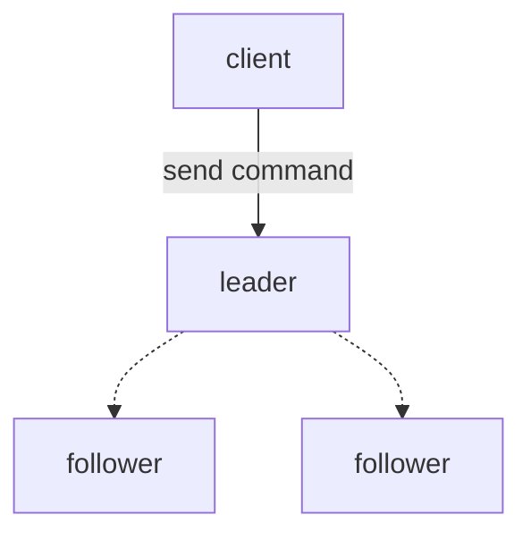
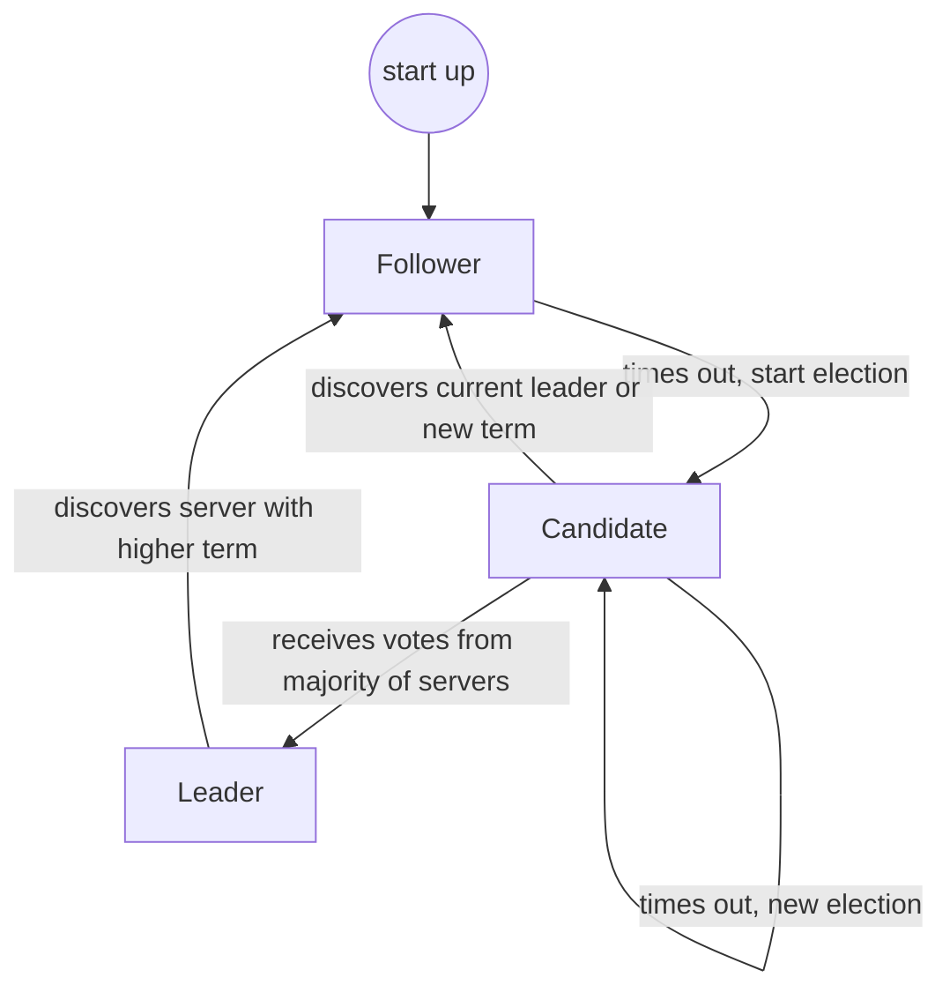
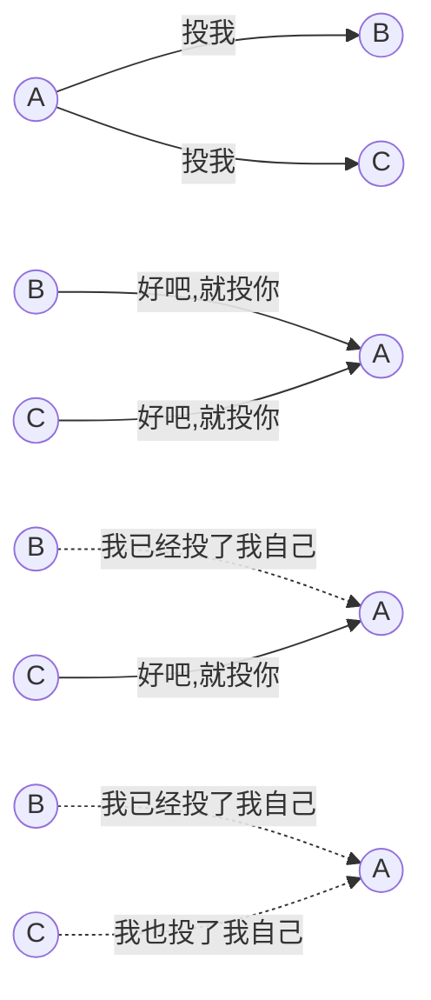

1. Leader选举（Leader election）
2. 日志同步（Log replication）
3. 安全性（Safety）
4. 日志压缩（Log compaction）
5. 成员变更（Membership change）

<!-- more -->

Raft将系统中的角色分为领导者（Leader）、跟从者（Follower）和候选人（Candidate）

-  Leader: 接受客户端的请求，向Follower同步请求日志，日志同步到大多数节点上后告诉Follower提交日志
- Follower：接受并持久化Leader同步的日志，在Leader告之日志可以提交后，提交日志
- Candidate：Leader选举过程中的临时角色

状态转换：

Leader选举

选举出Leader后，Leader通过定期向所有的Follower发送心跳信息维持其统治。若Follower一段时间未收到Leader的心跳则认为Leader已经挂掉，再次发起Leader选举过程。

日志同步

Reference:

[Paxo、Raft分布式一致性最佳实践](https://zhuanlan.zhihu.com/p/32052223)

[mermaid](https://mermaidjs.github.io/#/)

[mermaid绘图](markdown绘图插件----mermaid简介 - shiter编写程序的艺术 - CSDN博客)

